# AI Teacher

**An AI educator that reads your textbook, teaches it as a video, and changes
what it teaches next based on how you answer.**

Bharat Academix AI Innovation Hackathon 2026, Round 2 · Team **Code Gauntlet**

**[Live demo](https://web-4tn2vgzde-24911a05c5-3655s-projects.vercel.app)** ·
[Known limitations](docs/KNOWN_LIMITATIONS.md) · [Evaluation](docs/EVALUATION.md)

---

## The thesis: pedagogy as inspectable state

Most submissions will wrap an LLM in a video. This one carries an explicit,
**inspectable learner model**: a concept graph, Bayesian Knowledge Tracing
mastery per concept, and a 32-entry misconception taxonomy that is matched
**deterministically, before any model is called**.

Answer a checkpoint wrongly and the system does not say "incorrect". It names the
misconception from the taxonomy, drops the mastery estimate, re-explains with a
**different analogy family**, and asks a fresh diagnostic question.

That behaviour is asserted, offline, in `tests/test_adaptation.py`:

```
test_1_names_the_misconception                     PASSED
test_2_reexplains_with_a_different_analogy_family  PASSED
test_3_issues_a_new_diagnostic_question            PASSED
test_4_mastery_decreases                           PASSED
test_5_concept_enters_the_revision_plan            PASSED

11 passed in 1.42s
```

**1.42 seconds, zero API requests.** Because the match is deterministic, the test
carrying the highest-weighted category cannot flake on a network call, and the
live demo cannot fail because a model got creative. The taxonomy is a YAML file a
judge can read: [`services/pedagogy/misconceptions.yaml`](services/pedagogy/misconceptions.yaml).

---

## Measured results

| Metric | Value |
|---|---|
| Test suite | **68 passing** |
| The five adaptation assertions | offline, **1.42 s**, 0 requests |
| Retrieval accuracy | **10 / 10** questions to the correct section |
| Fabricated citations | **0** |
| Misconception taxonomy | 32 entries, 82 patterns, 5 subjects, 3 languages |
| Demo lesson | **40 beats**, 4 graphs, 3 checkpoints, 23 min |
| Gemini requests per lesson | **1** |
| Gemini requests, entire build | **16** |
| Rendered video A/V drift | 97 ms over 18.9 minutes |

Method and full numbers in [docs/EVALUATION.md](docs/EVALUATION.md). Everything
we know is imperfect, including a words-per-minute constant that is wrong for
English, is written up in [docs/KNOWN_LIMITATIONS.md](docs/KNOWN_LIMITATIONS.md)
rather than left for a judge to find.

---

## Architecture

```mermaid
flowchart LR
  A["Upload PDF / DOCX / PPTX<br/>or a bare topic"] --> B["PyMuPDF parse<br/>font-size heading clustering"]
  B --> C["Structure tree<br/>chapter / section / page"]
  C --> D["Chunk 300-500 tokens<br/>equation-safe"]
  D --> E["MiniLM embeddings<br/>numpy + BM25"]
  E --> F{"Hybrid retrieve<br/>RRF top 8"}
  F --> G["ONE Gemini call<br/>full LessonPlan"]
  G --> H["edge-tts<br/>word-level timings"]
  G --> I["Visual Director<br/>equation / graph / diagram / code / bullets"]
  H --> J["Slide renderer<br/>cues keyed to spoken words"]
  I --> J
  J --> K["Browser stage<br/>avatar + captions"]
  J --> L["Playwright + ffmpeg<br/>lesson.mp4"]
  K --> M{"Checkpoint"}
  M --> N["Deterministic grade<br/>32-entry taxonomy"]
  N --> O["BKT mastery<br/>SM-2 revision"]
  O --> P["Re-explain<br/>different analogy family"]
  P --> K
  O --> Q["Learning report"]
```



One renderer feeds both the live stage and the MP4, so what a judge sees in the
video is what a student sees in the app.

---

## Request budget

The free Gemini tier allows roughly 1,500 requests per day. Three things keep us
far inside it:

1. **One call per lesson.** Every beat script, visual spec, checkpoint question
   and citation arrives in a single structured response.
2. **Disk cache** keyed by SHA256 of (prompt, model, params). A repeated call
   costs zero requests, and the saving is counted and shown in the UI.
3. **Deterministic grading.** Answer grading and re-explanation hit the taxonomy,
   not a model. Grading costs **0 requests**.

`AI_TEACHER_OFFLINE=1` routes every call to a local Ollama model, so the whole
system runs with no internet and no API key at all.

---

## Quickstart

```bash
pip install -r requirements.txt
cp .env.example .env          # real keys go in .env, never in .env.example
python -m pytest -v           # 68 tests
uvicorn services.api.main:app --reload
```

```bash
cd apps/web && npm install && npm run dev
```

Develop without spending quota:

```bash
AI_TEACHER_OFFLINE=1 uvicorn services.api.main:app --reload
```

Full instructions in [docs/SETUP.md](docs/SETUP.md). The repo ships a
secret-blocking pre-commit hook: enable it once per clone with
`git config core.hooksPath .githooks`.

---

## Stack

| Layer | Choice | Licence / tier |
|---|---|---|
| Frontend | Next.js 16, React 19, framer-motion | MIT |
| Backend | FastAPI, Pydantic v2 | MIT |
| Lesson planning | Gemini 2.5 Flash | free tier |
| Grading fallback | Groq `openai/gpt-oss-120b` | free tier |
| Offline mode | Ollama `llama3.1:8b` | MIT |
| Embeddings | `paraphrase-multilingual-MiniLM-L12-v2` | Apache-2.0 |
| Retrieval | numpy + `rank_bm25`, RRF fusion | MIT / Apache-2.0 |
| Document parsing | PyMuPDF, python-docx, python-pptx | AGPL-3.0 / MIT |
| Speech | `edge-tts` with WordBoundary timings | GPL-3.0 |
| Visuals | KaTeX, Mermaid, inline SVG | MIT |
| Video | Playwright + ffmpeg | Apache-2.0 / LGPL-2.1 |

No paid services. Every third-party API, model and library is disclosed in
[docs/APIS.md](docs/APIS.md), as the brief requires.

---

## Documentation

[Problem](docs/PROBLEM.md) · [Solution](docs/SOLUTION.md) · [Features](docs/FEATURES.md) ·
[Architecture](docs/ARCHITECTURE.md) · [Models](docs/MODELS.md) · [RAG](docs/RAG.md) ·
[Agents and prompts](docs/AGENTS.md) · [Personalization](docs/PERSONALIZATION.md) ·
[Assessment](docs/ASSESSMENT.md) · [Multilingual](docs/MULTILINGUAL.md) ·
[Voice](docs/VOICE.md) · [Avatar and video](docs/AVATAR_VIDEO.md) ·
[APIs](docs/APIS.md) · [Setup](docs/SETUP.md) · [Deployment](docs/DEPLOYMENT.md) ·
[Known limitations](docs/KNOWN_LIMITATIONS.md) · [Evaluation](docs/EVALUATION.md) ·
[Submission](docs/SUBMISSION.md)

---

## Team

**Code Gauntlet**
Vedant Manmath Idlgave
Vidya Jyothi Institute of Technology (VJIT), Hyderabad
