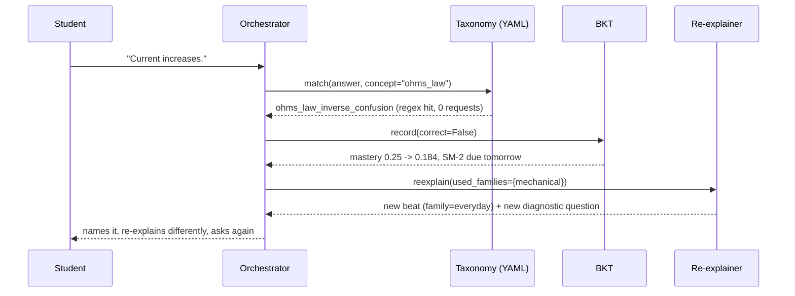

# Architecture

The full diagram is in the [README](../README.md#architecture). This document
covers one adaptive loop in detail.

## Sequence: a wrong answer

No network call anywhere in that path.

## Module map

| Path | Responsibility |
|---|---|
| `services/ingest/` | parse, structure tree, chunk, embed, index |
| `services/rag/` | hybrid retrieval, RRF fusion, groundedness scoring |
| `services/llm/` | router, disk cache, budget accountant, Pydantic schemas, prompts |
| `services/pedagogy/` | planner, grader, taxonomy, BKT, orchestrator |
| `services/visual/` | Visual Director, slide renderer, Mermaid sanitiser |
| `services/speech/` | edge-tts, word-timing alignment, voice config |
| `services/studio/` | Playwright recording, CFR normalisation, ffmpeg mux |
| `apps/web/` | landing, setup flow, lesson stage, report |

Orchestration is plain Python. No LangChain, no agent framework: they would hide
the architecture being graded.
